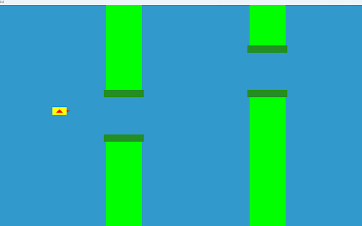

# Flappy-Bird

In this project, I have designed a game by using [C++](https://cplusplus.com/doc/tutorial/) and basic [OpenGL](https://www.opengl.org/) functions.

# Description 

Flappy Bird is a very popular game on many platforms, driving a lot of people crazy. In this game, the player can control the vertical movement of the bird. Every pressing on the keyboard makes the bird leap upward for a little bit, and the bird will fall freely without control. As soon as the game begins, tubes will keep appearing from the right side of the screen and moving leftwards so that it seems like the bird is flying forward. The goal of this game is to control the bird, dodging and passing the incoming tubes, as many as possible. The game is endless until the bird eventually hit one of the tubes, ground, or ceiling.

# Game Controls 

| Actions    | Buttons |
| ----------- | ----------- |
|  The bird leap upward     |  Keyboard Space Button or Mouse Left Click  |
| Pause the game  |   Mouse Right Click    |
| Restart the game after ending |   Keyboard Space Button |
| Restart or Exit after pausing the game | Select with Mouse Left Click |

# Gameplay 

# Installation

### Requirements

* Programming Language: C++ using OpenGL
* Operating System: Windows Operating System
* Compiler: GCC Compiler
* Graphics Library: GL/glut.h
* OpenGL 2.0

Install OpenGL 2.0 and then create a glut project. After that run the main.cpp file.

